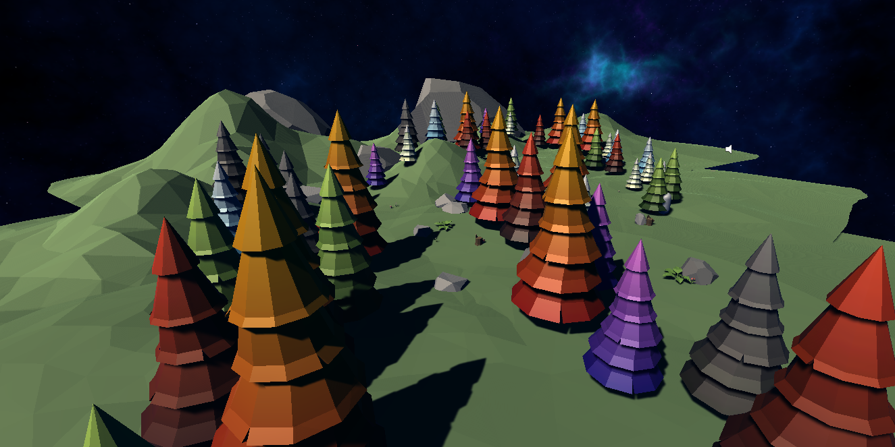
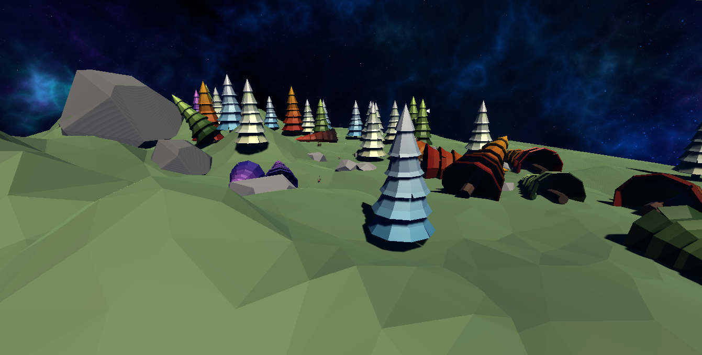

# Planticland
 
What is the Planticland?

Planticland is a Unity project I developed to implement Object Oriented Programming (OOP) principles. It can be called a very simple tree planting simulation. It took me a whole day to complete it up to this stage.

___

How is it working?

The user can plant trees with a mouse click, and a random tree is planted each time.
Each tree has its own growth rate, maximum growth capacity and life span. When they reach the end of their lives, they fall to the ground and die.

___

## Screen Shots

WATCH ON YOUTUBE:

